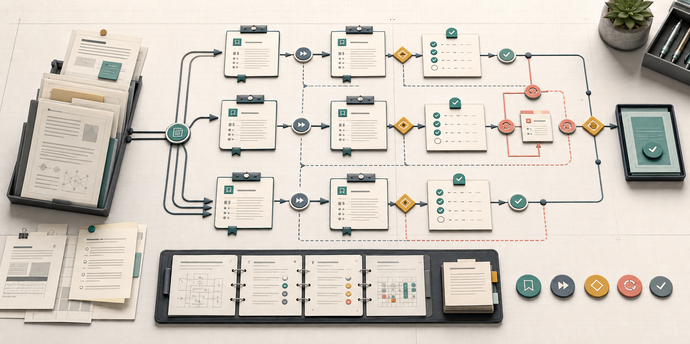
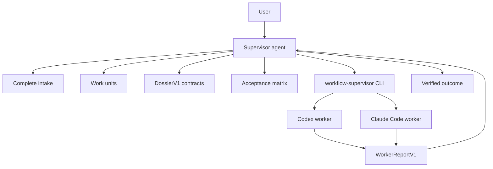

# Workflow Supervisor

Workflow Supervisor is a strict supervision skill pack and small npm helper for agent work that must stay grounded, resumable, and verifiable.

It turns an instruction such as:

```text
Use $workflow-supervisor to build a FastAPI Naive RAG demo.
```

into a full supervised workflow: complete intake, source grounding, bounded work units, dossiers, worker-agent handoffs, structured worker reports, verification, repair routing, documentation, and final disposition.

When explicitly invoked, it must run the full workflow even for tiny tasks. The point is not task-size judgment. The point is reliable supervision.



## Current Architecture

Workflow Supervisor has two parts:

- A skill pack in `skills/` that teaches an agent how to supervise a workflow.
- A small CLI in `bin/workflow-skills.mjs` that installs skills, validates artifacts, and runs one role-scoped worker process.

It is not a workflow daemon, queue, scheduler, or giant harness. The current chat agent remains the supervisor. The CLI is a helper.



The supervisor owns coordination. Workers do scoped work and report back.

## Strict Invocation Contract

When the user explicitly invokes `workflow-supervisor`, `$workflow-supervisor`, or says to use the skill, the workflow enters `strict_full_workflow`.

Strict mode always requires:

- complete intake before goal creation, planning beyond intake, worker delegation, implementation, publication, or irreversible action
- a human approval question before implementation unless intake explicitly selects `autonomous_goal`
- a source corpus map, even when the only sources are the user prompt and current workspace
- at least one bounded work unit, using `WU-001` for tiny tasks
- a dossier for every implementation unit before implementation starts
- an acceptance matrix or explicit draft acceptance rows
- a worker-agent plan for implementer, verifier, repair-author, and documenter responsibilities
- lifecycle tracking: `planned -> handed_off -> acknowledged -> reported -> verified -> closed`
- verification labeled as `self-check`, `focused-check`, or `independent-verifier`
- a final disposition decision after verification

The supervisor must not decide that a task is too simple to receive the full workflow once the skill is explicitly invoked.

## Worker Model

Workers are separate role-scoped agent runs. They are not imaginary same-thread personas.

The required worker responsibilities are:

- `implementer`: changes only the allowed surfaces from the dossier
- `verifier`: checks evidence and must not edit implementation
- `repair-author`: converts failed acceptance rows or verifier findings into repair tickets
- `documenter`: records workflow, outcome, and approved documentation updates

The CLI schema uses role value `repair` for the repair-author function:

```bash
workflow-supervisor delegate --agent codex --role repair --unit WU-001 --dossier .workflow/dossiers/WU-001-repair.yaml
```

Each worker receives only:

- role
- dossier
- sources
- acceptance rows
- stop gates
- report schema

Each worker returns one `WorkerReportV1`. The supervisor consumes the report and decides the next step.

Workers must not ask the human questions directly, approve plans, choose final disposition, expand scope, or message each other.

## No Silent Fallbacks

Worker agents are mandatory when the environment provides worker, subagent, thread, or portable delegation tools.

If the supervisor cannot create, message, or delegate to worker agents, it must record:

```text
worker_agent_unavailable
```

Then it must stop for a human decision, unless complete intake explicitly selected `same_session_phased`.

Same-session phased work is a degraded mode. Verification in that mode is a self-check, never an `independent-verifier`.

## Lifecycle

The supervisor loop is:

```text
complete intake
-> source corpus
-> work units
-> acceptance matrix
-> dossiers
-> approval or autonomous path gate
-> worker handoff
-> worker report
-> verification
-> repair if needed
-> re-verification
-> documentation
-> final disposition
```

Worker lifecycle is tracked separately:

```text
planned -> handed_off -> acknowledged -> reported -> verified -> closed
```

Expected human pauses are workflow pauses, not terminal failure. Approval and answer gates should be recorded as `WAITING_FOR_HUMAN`, then resumed as `ACTIVE` after the user approves or answers.

## Intake Gate

Every supervisor invocation must answer all intake items before work starts:

```text
1. Objective and source: what artifact, spec, repo path, document, ticket, or source set controls the work?
2. Execution path: autonomous_goal or human_in_loop?
3. Mode: sequential, parallel where safe, or staged parallel?
4. Delegation: automated worker delegation, native threads/subagents if available, or same-session phased?
5. Final disposition: keep local, open PR, push main, deploy/publish, or ask at the end?
6. Boundaries: may I install dependencies, call external services, use credentials, or only edit local files?
7. State artifacts: create .workflow docs, use another artifact directory, or keep state inline?
```

If any answer is missing, vague, delegated to judgment, or contradicted by another answer, the supervisor asks the missing question and stops.

## Dossier Gate

Workers start only after a concrete `DossierV1` exists.

A dossier must name:

- work unit
- worker name and role
- delegation transport
- start condition
- objective and non-goals
- source corpus and must-read sources
- allowed and forbidden surfaces
- acceptance rows
- adversarial checks
- required commands or evidence
- worker prompt
- supervisor checkpoints
- completion and verification report schemas
- stop gates
- assumptions and open questions

Validate before delegation:

```bash
workflow-supervisor validate-dossier .workflow/dossiers/WU-001-implementer.yaml --role implementer --unit WU-001 --json
```

The validator rejects vague mutable surfaces such as `all files`, unresolved open questions, role mismatches, missing acceptance rows, missing forbidden surfaces, and worker prompts that do not require `WorkerReportV1`.

## Worker Reports

Every delegated worker must return `WorkerReportV1`.

Example:

```json
{
  "schema": "WorkerReportV1",
  "status": "PASS",
  "role": "verifier",
  "unit_id": "WU-001",
  "summary": "Verified the API responses and RAG retrieval behavior against the acceptance rows.",
  "changed_surfaces": [],
  "evidence": ["pytest tests/test_api.py passed", "manual inspection of /health response"],
  "checks_run": ["pytest tests/test_api.py"],
  "skipped_checks": [],
  "findings": [],
  "blocking_question": null,
  "next_action": "supervisor_review",
  "adapter": null,
  "guard": null,
  "reason": null
}
```

The delegate wrapper normalizes missing CLIs, invalid output, timeouts, auth-like failures, PASS without evidence, forbidden-surface changes, and verifier mutations into structured `BLOCKED` reports.

## Durable State

Workflow state lives under `.workflow/` by default:

```text
.workflow/WORKFLOW.md
.workflow/SOURCE-CORPUS.md
.workflow/WORK-UNITS.md
.workflow/DOSSIER.md
.workflow/WORKER-MAP.md
.workflow/ACCEPTANCE-MATRIX.md
.workflow/VERIFICATION-REPORT.md
.workflow/REPAIR-TICKETS.md
.workflow/DECISIONS.md
.workflow/HANDOFF.md
.workflow/OUTCOME.md
.workflow/GOAL-STATE.md
```

In Git-backed projects, `.workflow/` is local supervisor memory. It must be ignored before artifacts are written there.

This repository ignores `.workflow/`, and project installs also ensure the target project `.gitignore` contains:

```gitignore
.workflow/
```

Do not stage, commit, push, or publish `.workflow/` unless the user explicitly makes workflow state a final deliverable.

## Install

From a local checkout:

```bash
git clone https://github.com/NikolaCehic/workflow-supervisor.git
cd workflow-supervisor
npm install
npm run validate
```

Install for Codex:

```bash
npx workflow-supervisor install --agent codex --scope user
```

Install for Claude Code:

```bash
npx workflow-supervisor install --agent claude-code --scope user
```

Install both certified targets into a project:

```bash
npx workflow-supervisor install --agent all --scope project --project .
```

Project installs copy skills into project-level agent folders and add `.workflow/` to the target project's `.gitignore`.

## CLI

Useful commands:

```bash
workflow-supervisor list
workflow-supervisor validate
workflow-supervisor doctor --agent all
workflow-supervisor install --agent codex --scope user
workflow-supervisor install --agent claude-code --scope user
workflow-supervisor emit-context --agent generic --out AGENTS.md
workflow-supervisor validate-dossier .workflow/dossiers/WU-001-implementer.yaml --role implementer --unit WU-001 --json
workflow-supervisor delegate --agent codex --role implementer --unit WU-001 --cwd . --dossier .workflow/dossiers/WU-001-implementer.yaml
workflow-supervisor delegate --agent claude-code --role verifier --unit WU-001 --cwd . --dossier .workflow/dossiers/WU-001-verifier.yaml
workflow-supervisor delegate-doctor --agent all --probe --require-pass
```

Certified automated delegation targets:

- `codex`
- `claude-code`

The `generic` target is for Markdown instruction export or custom skill installation. It is not a certified automated delegation adapter.

## Supported Files

Package layout:

```text
skills/                  Skill instructions
skills/*/agents/          Agent metadata, including Codex openai.yaml files
schemas/                 DossierV1 and WorkerReportV1 schemas
adapters/                Codex and Claude Code delegate command arrays
docs/                    CLI, artifact, compatibility, and troubleshooting docs
bin/workflow-skills.mjs  Installer, validator, delegation wrapper, and command dispatch
```

The `agents/openai.yaml` files do not mean Claude Code is unsupported. Claude Code uses the same `SKILL.md` folders and the `claude` CLI adapter. The OpenAI metadata exists because Codex has a specific metadata format.

## Use

In Codex or Claude Code:

```text
Use $workflow-supervisor to implement a healthcare specialist FastAPI Naive RAG demo.
```

The correct first response is the complete intake packet, not implementation.

After intake, the supervisor creates the plan, work units, dossiers, acceptance rows, worker plan, approval gate, and stop gates. Only then may it start worker delegation.

## Agent Rules

If you are an AI agent reading this README:

1. Do not start work before complete intake.
2. Do not infer missing permissions from intent words like "autonomous", "generate", or "work until done".
3. Always create at least one work unit when `$workflow-supervisor` is explicit.
4. Do not delegate without a valid `DossierV1`.
5. Use separate worker agents when supported by the environment.
6. Do not silently collapse worker agents into same-thread roleplay.
7. Treat same-session verification as `self-check`, not `independent-verifier`.
8. Trust only structured `WorkerReportV1` results from workers.
9. Treat verifier edits as invalid.
10. Keep `.workflow/` ignored and local unless the user explicitly asks to publish it.

The design goal is strict supervision without becoming a big harness: small artifacts, explicit gates, scoped workers, normalized reports, and no quiet drift.
