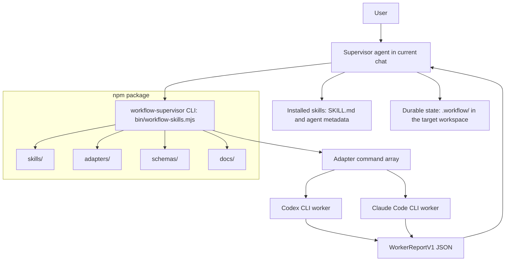
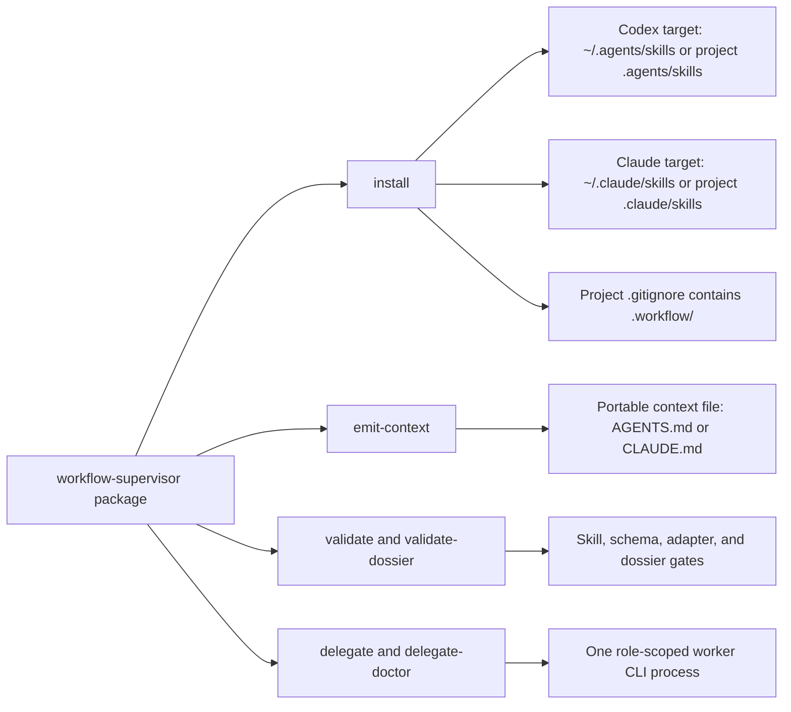
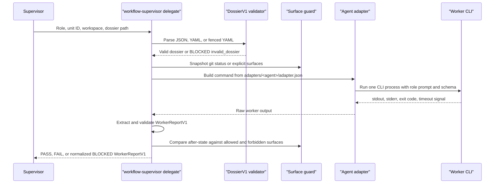
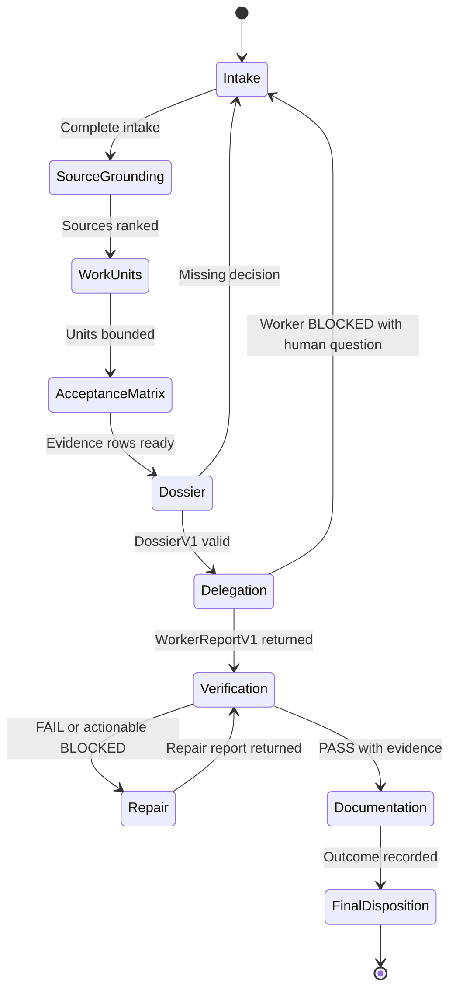

# Workflow Supervisor

Workflow Supervisor is a small skill pack and npm helper for making coding agents handle complex work with discipline.

It turns a vague request like:

```text
Use workflow-supervisor to migrate the database from SQLite to LanceDB.
```

into a supervised workflow with intake, source grounding, bounded work units, concrete worker dossiers, independent verification, repair loops, and evidence-backed output.

It currently supports certified automated worker delegation for **Codex** and **Claude Code**.


## What It Is

Workflow Supervisor is not another agent product. It is a thin coordination layer for agents that already exist.

The supervisor is the visible agent in the conversation. It owns the plan, asks the user questions, creates work units, validates worker contracts, launches workers, reads reports, and decides what happens next.

Workers are short-lived CLI runs:

```bash
workflow-supervisor delegate --agent codex --role implementer --unit U1 --dossier .workflow/dossiers/U1.yaml
workflow-supervisor delegate --agent claude-code --role verifier --unit U1 --dossier .workflow/dossiers/U1.yaml
```

Each worker gets only the context it needs. It returns one structured report. The supervisor remains the coordinator.

## The Moat

The moat is not a clever prompt. The moat is the set of gates that prevent agents from drifting.

Workflow Supervisor enforces:

- complete intake before work starts
- no keyword-based skipping
- bounded work units before implementation
- machine-checkable `DossierV1` before workers start
- role separation between implementer, verifier, repair, and documenter
- normalized `WorkerReportV1` output from every worker
- evidence required for PASS
- automatic BLOCKED reports for vague dossiers, missing CLIs, auth failures, invalid output, timeouts, forbidden edits, or verifier mutations

That means the system does not merely ask agents to behave. It blocks unsafe or vague execution before it happens.

## What It Solves

Large agent tasks fail in predictable ways:

- the agent starts before asking enough questions
- "autonomous" or "use workflow supervisor" gets treated as permission to act
- the context window fills with unrelated history
- handoffs are vague
- implementers verify their own work
- verifiers say "looks good" without evidence
- repair work expands scope
- progress disappears after context compaction
- every platform has a different output style

Workflow Supervisor solves this by making the workflow explicit and resumable.

The conversation holds the supervisor. The `.workflow/` artifacts hold durable state. Workers get small, role-specific dossiers instead of the full conversation. Reports come back in one schema.

## Architecture

Workflow Supervisor has two halves: a portable skill pack that teaches an agent how to supervise work, and a small npm CLI that installs those skills, validates contracts, and runs one-shot worker delegations.

The current chat agent is always the supervisor. It owns intake, planning, source grounding, work-unit boundaries, dossiers, verification decisions, repair routing, and final disposition. The CLI never becomes a workflow daemon or queue. It is a helper that copies skills into supported agent directories, emits portable Markdown context, validates schema-backed artifacts, and invokes a single role-scoped worker process when delegation is authorized.



The package layout is intentionally simple:

- `skills/` contains the opt-in supervisor skills and OpenAI metadata prompts.
- `bin/workflow-skills.mjs` contains the installer, validator, context emitter, delegation wrapper, surface guard, and command dispatch.
- `schemas/` defines `DossierV1` and `WorkerReportV1`.
- `adapters/` defines certified Codex and Claude Code command arrays.
- `docs/` explains CLI usage, portable delegation semantics, compatibility, artifacts, and troubleshooting.
- `.workflow/` is created in consuming projects as private supervisor working memory, not as package state.



Delegation is a guarded subprocess, not an open-ended conversation between agents. The supervisor creates a concrete `DossierV1`, the CLI validates it before any worker starts, the adapter receives a role-scoped prompt and the `WorkerReportV1` schema, and the wrapper normalizes failure modes into structured `BLOCKED` reports.



The supervisor loop is therefore stateful at the workflow level but stateless at the worker level. Every worker run is fresh, bounded by one dossier, and reduced back to one report before the supervisor decides the next step.



## What It Is Used For

Use it for work that is:

- broad or ambiguous
- multi-step
- high-risk
- likely to need repair loops
- likely to exceed one context window
- important enough to require independent verification
- easier to handle as several bounded units

Good examples:

- migrate SQLite storage to LanceDB
- refactor authentication across several modules
- update docs from a new API spec
- implement a feature with tests and verification
- review and repair a messy PR
- produce durable workflow docs for a long-running task

Do not use it for:

- tiny edits
- one-off shell commands
- obvious single-file changes
- quick explanations
- tasks where a normal agent turn is enough

## How It Works

The lifecycle is:

```text
intake
-> source grounding
-> work units
-> acceptance matrix
-> DossierV1
-> worker delegation
-> WorkerReportV1
-> verification
-> repair if needed
-> re-verification
-> documentation
-> final disposition
```

### 1. Intake

The supervisor must ask the user for every required decision before it plans deeply or starts work:

```text
1. Objective and source
2. Execution path: autonomous_goal or human_in_loop
3. Mode: sequential, parallel where safe, or staged parallel
4. Delegation: automated workers, native subagents if available, or same-session phased
5. Final disposition: keep local, open PR, push, deploy, publish, or ask at end
6. Boundaries: installs, network, credentials, destructive operations, forbidden surfaces
7. State artifacts: .workflow docs, another directory, or inline state
```

If any answer is missing or vague, the supervisor asks again and stops.

### 2. Source Grounding

The supervisor identifies the source of truth: files, specs, docs, tickets, user decisions, commands, or external constraints.

If source authority is unclear, the first work unit becomes discovery instead of implementation.

### 3. Work Units

The supervisor splits the objective into bounded units.

For a SQLite to LanceDB migration, units might be:

```text
U1 dependency and config
U2 storage adapter
U3 data migration path
U4 tests and regression checks
U5 docs and outcome report
```

### 4. DossierV1

Before any worker starts, the supervisor creates a concrete `DossierV1`.

A dossier names:

- the exact work unit
- the worker role
- allowed surfaces
- forbidden surfaces
- must-read sources
- acceptance rows
- required evidence
- adversarial checks
- stop gates
- required report schema

Then the package validates it:

```bash
workflow-supervisor validate-dossier .workflow/dossiers/U2-implementer.yaml --role implementer --unit U2 --json
```

If the dossier says `all files`, `TBD`, `unknown`, `as needed`, or leaves open questions unresolved, it fails. No worker starts.

### 5. Worker Delegation

The supervisor launches one role-scoped worker through Codex or Claude Code.

```bash
workflow-supervisor delegate --agent codex --role implementer --unit U2 --dossier .workflow/dossiers/U2-implementer.yaml
```

The worker does not get the whole chat. It receives the dossier and report schema.

### 6. Verification And Repair

A verifier checks the implementer's work against acceptance rows.

If verification fails, the supervisor creates repair work. Repairs must point back to verifier findings or acceptance rows. After repair, verification runs again.

### 7. Final Disposition

The supervisor applies the final disposition chosen during intake:

- keep changes local
- open a PR
- push
- deploy
- publish
- ask at the end

No final irreversible action is inferred from vibes.

## What The User Sees

The user sees the supervisor, not worker chatter.

In `human_in_loop`, the user sees:

```text
intake question
approval packet
progress summaries
blocker questions if needed
final report
```

In `autonomous_goal`, the user sees:

```text
intake question
execution plan
periodic progress summaries
blockers only when needed
final report
```

Workers do not ask the user questions directly. They return `BLOCKED` and the supervisor decides how to route it.

## What The Output Is

Workflow Supervisor produces three kinds of output.

### 1. Durable Workflow State

Usually under `.workflow/`:

```text
WORKFLOW.md
SOURCE-CORPUS.md
WORK-UNITS.md
DOSSIER.md
WORKER-MAP.md
ACCEPTANCE-MATRIX.md
VERIFICATION-REPORT.md
REPAIR-TICKETS.md
DECISIONS.md
HANDOFF.md
OUTCOME.md
GOAL-STATE.md
```

These files make the workflow resumable after context compaction or handoff.

### 2. Worker Reports

Every worker returns `WorkerReportV1`:

```json
{
  "schema": "WorkerReportV1",
  "status": "PASS",
  "role": "verifier",
  "unit_id": "U2",
  "summary": "Verified LanceDB-backed search path.",
  "changed_surfaces": [],
  "evidence": ["pytest tests/test_search.py passed"],
  "checks_run": ["pytest tests/test_search.py"],
  "skipped_checks": [],
  "findings": [],
  "blocking_question": null,
  "next_action": "supervisor_review",
  "adapter": null,
  "guard": null,
  "reason": null
}
```

### 3. Final Supervisor Report

The final report names:

- execution path
- goal status
- sources used
- work units completed
- workers delegated
- checks run
- skipped checks
- repairs performed
- residual risks
- final disposition
- next action

## How To Install

From a local checkout:

```bash
git clone https://github.com/NikolaCehic/workflow-supervisor.git
cd workflow-supervisor
npm run validate
```

Install for Codex:

```bash
npx workflow-supervisor install --agent codex --scope user
```

Install for Claude Code:

```bash
npx workflow-supervisor install --agent claude-code --scope user
```

Install for both in a project:

```bash
npx workflow-supervisor install --agent all --scope project --project .
```

Project installs also add `.workflow/` to the target project's `.gitignore`. Workflow state is local working memory by default; it should not be pushed with the consuming codebase unless the user explicitly chooses that.

Export generic Markdown instructions:

```bash
npx workflow-supervisor emit-context --agent generic --out AGENTS.md
```

## How To Use

In Codex or Claude Code, ask explicitly:

```text
Use $workflow-supervisor to migrate this repo from SQLite to LanceDB.
```

The correct next step is not implementation. The correct next step is the intake packet.

After intake is complete, the supervisor proceeds through work units, dossiers, workers, verification, repair, and final disposition.

Useful CLI commands:

```bash
workflow-supervisor validate
workflow-supervisor validate-dossier .workflow/dossiers/U2-implementer.yaml --role implementer --unit U2 --json
workflow-supervisor delegate --agent codex --role implementer --unit U2 --dossier .workflow/dossiers/U2-implementer.yaml
workflow-supervisor delegate --agent claude-code --role verifier --unit U2 --dossier .workflow/dossiers/U2-verifier.yaml
workflow-supervisor delegate-doctor --agent all --probe --require-pass
```

## For Agents

If you are an AI agent reading this README, follow these rules:

1. Do not start work before complete intake.
2. Do not infer missing permissions from user intent.
3. Do not delegate without a valid `DossierV1`.
4. Do not accept worker prose as completion.
5. Trust only `WorkerReportV1` reports.
6. Treat verifier edits as invalid.
7. Ask the user only through the supervisor.
8. Before creating `.workflow/` in a codebase, ensure `.gitignore` contains `.workflow/`.
9. Preserve enough `.workflow/` state for another agent to resume, but do not stage or publish it unless explicitly requested.

The point is not to add ceremony. The point is to make complex agent work hard to derail.
