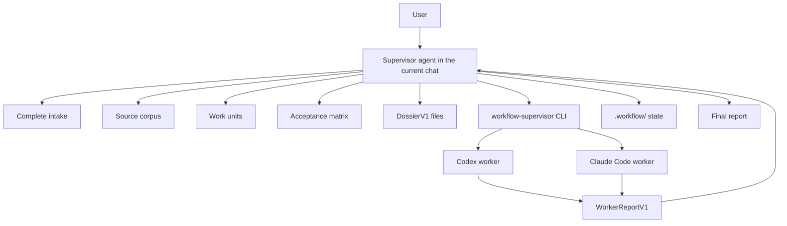

# Workflow Supervisor

Workflow Supervisor is a profile-based supervision skill pack for agent work that needs to stay organized, resumable, evidence-backed, and proportional to the work.

It is for moments when you do not want an agent to lose the thread halfway through, quietly skip scope, or turn a large backlog into an unreviewable blur. You ask for the supervisor, the supervisor selects the right execution profile, keeps the work units explicit, verifies results with evidence, and leaves a clear outcome trail. Heavy multi-agent ceremony is available when risk justifies it; large pure backlogs can use a lean runner that keeps the agent focused on delivery.

Example prompt:

```text
Use $workflow-supervisor to build a FastAPI Naive RAG demo for a healthcare specialist agent.
```

The correct first response is not code. The correct first response is an intake packet. That is intentional.


## What You Get

Workflow Supervisor gives you a repeatable workflow for serious agent tasks:

- a complete intake before work starts
- a profile choice between `lean_work_unit_runner`, `strict_full_workflow`, and `planning_only`
- a source map, even when the only source is the user prompt
- a source-requirement coverage ledger so roadmap items and exit criteria cannot disappear
- a `SPEC.md` review gate where humans can ask questions, request revisions, block, defer, or approve before work units are finalized
- bounded work units, including `WU-001` for tiny tasks
- a compact ledger for high-throughput work-unit execution
- dossiers that tell each worker exactly what to do and what not to touch
- separate implementer, verifier, repair, and documenter responsibilities
- structured worker reports instead of loose prose
- evidence-based verification
- repair loops that stay tied to failed acceptance rows
- durable `.workflow/` state when the work needs to survive context loss
- a final report with checks, risks, workers, and next actions

The main design choice is simple: supervision is mandatory when requested, but overhead is profile-dependent. Work units preserve clarity. Workers, dossiers, and independent verifier loops are tools for strict or escalated work, not a default tax on every unit.

## The Mental Model

Think of Workflow Supervisor as a project lead inside the current agent conversation.

The supervisor:

- asks the user for missing decisions
- decides when work is ready to start
- creates the plan, units, dossiers, and acceptance rows
- hands work to role-specific workers
- reads worker reports
- routes blockers and repairs
- decides when verification is good enough
- applies the final disposition policy

Workers:

- receive one scoped dossier
- perform one role
- return one structured report
- do not talk to the human directly
- do not choose final disposition
- do not message each other

The CLI:

- installs the skills
- validates skill and schema files
- validates `DossierV1`
- invokes one worker process
- validates `WorkerReportV1`
- returns a normalized report to the supervisor

It is not a daemon, queue, dashboard, scheduler, or full agent harness.



## What Happens When You Invoke It

When you explicitly invoke `workflow-supervisor`, `$workflow-supervisor`, or say to use the skill, the first decision is the execution profile:

- `lean_work_unit_runner`: for large, already-bounded work-unit backlogs where throughput and low memory matter.
- `strict_full_workflow`: for ambiguous, high-risk, delegated, security-sensitive, source-of-truth, publication, or cross-system work.
- `planning_only`: for intake, sequencing, risk review, and recommendations without implementation.

Lean mode keeps work units but removes per-unit ceremony. It uses one upfront scope contract, one compact ledger, targeted checks, and strict escalation gates:

```text
select next ready unit
-> inspect only needed sources
-> patch or update the allowed surface
-> run the targeted check
-> update one ledger row
-> continue until batch checkpoint, blocker, or final disposition
```

A lean unit is not ready unless it has:

```yaml
id:
source_ref:
scope:
done:
check:
status:
```

Strict mode is still available when risk justifies it. In strict mode, task size does not matter. The full workflow is:

1. Ask the complete intake packet.
2. Build or record the source corpus.
3. Create a source-requirement coverage ledger.
4. Create a `SPEC.md` review packet or file.
5. Pause for human Q&A, revisions, block, defer, or approval when the path is human-in-loop.
6. Create at least one work unit.
7. Create acceptance rows that preserve source-scope fidelity.
8. Create dossiers for the planned workers.
9. Create a worker-agent plan.
10. Ask for approval when the selected path is human-in-loop.
11. Delegate scoped work to real workers when the environment supports it.
12. Verify with evidence.
13. Route repair work if verification fails.
14. Refresh docs or outcome state.
15. Report final status and next action.

Profile selection exists to prevent both failure modes: skipping supervision when work is risky, and drowning simple or already-bounded work in process.

## Intake

The supervisor must get explicit answers to these eight items before planning deeply, creating a goal, delegating workers, implementing, publishing, or taking irreversible action:

```text
1. Objective and source: what artifact, spec, repo path, document, ticket, or source set controls the work?
2. Profile: lean_work_unit_runner, strict_full_workflow, or planning_only?
3. Execution path: autonomous_goal or human_in_loop?
4. Mode: sequential, parallel where safe, or staged parallel?
5. Delegation: same-session phased, automated worker delegation, or native threads/subagents if available?
6. Final disposition: keep local, open PR, push main, deploy/publish, or ask at the end?
7. Boundaries: may I install dependencies, call external services, use credentials, or only edit local files?
8. State artifacts: compact ledger, .workflow docs, another artifact directory, or inline state?
```

If any answer is missing or vague, the supervisor asks only for the missing pieces and stops. Phrases like "work autonomously", "just do it", or "use your judgment" do not fill in the missing intake fields.

Expected human pauses are normal. A workflow can move from `WAITING_FOR_HUMAN` back to `ACTIVE` after the user approves a plan or answers a blocker question.

In `autonomous_goal`, a human clarification pause is not automatically a terminal failed goal. The supervisor records the blocker, asks the smallest needed question, updates SPEC/Q&A/coverage state when the answer arrives, refreshes only affected downstream artifacts, and resumes from the recorded next action. If an old Codex goal was already terminal-blocked, the resumed workflow references it as history and continues from workflow state or a newly authorized goal binding.

## The Workflow

The full loop looks like this:

```text
complete intake
-> source corpus
-> source-requirement coverage ledger
-> SPEC review and Q&A gate
-> work units
-> loop policy
-> acceptance matrix
-> dossiers
-> approval or autonomous path gate
-> worker handoff
-> worker report
-> verification
-> repair if needed
-> re-verification
-> documentation
-> final disposition
```

The worker lifecycle is tracked separately:

```text
planned -> handed_off -> acknowledged -> reported -> verified -> resource_closed -> closed
```

This makes it possible to see where the workflow is, which worker owns which piece, what evidence exists, what native resource was opened, and whether that resource was closed. A native worker is not closed just because it returned a report.

For source-of-truth builds, the coverage ledger is the guardrail against "green but incomplete" outcomes. Every material source requirement must be mapped to a work unit and acceptance row, explicitly deferred by the user, blocked as a scope decision, or marked non-material with a reason. Residual risks and future-work notes cannot contain unimplemented material source requirements in a PASS workflow.

`SPEC.md` is the human review contract before final work units. In human-in-loop mode, the supervisor stops at the draft SPEC so the human can ask questions, request revisions, mark items deferred, block the workflow, or approve. The workflow continues only after explicit approval.

When a workflow pauses for a human decision, the decision is recorded as state rather than treated as a restart. The next supervisor pass updates the affected coverage rows, SPEC fields, work units, acceptance rows, dossiers, or verification results, invalidates stale artifacts, and continues from the saved `Next Action`.

## Skills In The Pack

The skill pack is made of small focused skills. The supervisor can use them as phase instructions.

| Skill | What it does |
|---|---|
| `workflow-supervisor` | Coordinates the whole workflow, gates, workers, verification, repair, and final disposition. |
| `source-corpus` | Lists and ranks sources, gaps, contradictions, authority, freshness, and allowed next action. |
| `work-unit` | Turns the objective into bounded units with dependencies, surfaces, readiness, and done criteria. |
| `loop-policy` | Defines execution path, mode, approval gates, repair limits, budgets, goal policy, and resume behavior. |
| `acceptance-matrix` | Turns requirements into evidence rows with PASS, FAIL, BLOCKED, and waiver handling. |
| `dossier-builder` | Creates concrete `DossierV1` contracts for workers. |
| `worker-roles` | Defines role boundaries so implementers, verifiers, repair authors, and documenters do not blur together. |
| `workflow-docs` | Creates or refreshes durable `.workflow/` artifacts when state needs to persist. |

Loading a skill does not spawn a worker. A skill is instruction context for the current supervisor. A worker is a separate role-scoped execution run.

## Files The Workflow Creates

Workflow state lives under `.workflow/` by default. The directory is local supervisor memory, not product code.

In a Git-backed project, `.workflow/` must be in `.gitignore` before these files are written. Project installs do this automatically.

Common workflow files:

| File | Created from | Purpose |
|---|---|---|
| `.workflow/WORKFLOW.md` | `workflow-supervisor`, `loop-policy`, `workflow-docs` | Main state, objective, execution path, policy, stop gates, next action. |
| `.workflow/SOURCE-CORPUS.md` | `source-corpus`, `workflow-docs` | Source ranking, missing sources, contradictions, assumptions. |
| `.workflow/SPEC.md` | `workflow-supervisor`, `source-corpus`, `workflow-docs` | Human-reviewable interpretation, requirement coverage, Q&A, and approval decision before work units. |
| `.workflow/WORK-UNITS.md` | `work-unit`, `workflow-docs` | Unit list, dependencies, sequencing, blocked units. |
| `.workflow/DOSSIER.md` or `.workflow/dossiers/*.yaml` | `dossier-builder`, `workflow-docs` | Worker contracts for implementation, verification, repair, or documentation. |
| `.workflow/WORKER-MAP.md` | `workflow-supervisor`, `worker-roles`, `workflow-docs` | Worker names, roles, transports, native resource ids, lifecycle, reports, close results, blockers. |
| `.workflow/ACCEPTANCE-MATRIX.md` | `acceptance-matrix`, `workflow-docs` | Evidence rows and material PASS, FAIL, BLOCKED states. |
| `.workflow/VERIFICATION-REPORT.md` | verifier worker, `acceptance-matrix`, `workflow-docs` | Verification evidence, findings, skipped checks, residual risks. |
| `.workflow/REPAIR-TICKETS.md` | repair worker, `workflow-docs` | Repair tasks tied to failed rows or verifier findings. |
| `.workflow/DECISIONS.md` | supervisor, `workflow-docs` | User decisions, assumptions, reversals, unresolved questions. |
| `.workflow/HANDOFF.md` | supervisor, `workflow-docs` | Resume pack for another agent or later session. |
| `.workflow/OUTCOME.md` | supervisor, documenter worker, `workflow-docs` | Final status, checks, risks, disposition, next action. |
| `.workflow/GOAL-STATE.md` | supervisor, `workflow-docs` | Codex goal mirror, blocked-goal history, human-decision resume checkpoint, and durable backup. |

For documentation-heavy workflows, `workflow-docs` can also create:

```text
.workflow/DOCUMENTATION-BRIEF.md
.workflow/CONTENT-INVENTORY.md
.workflow/OUTLINE.md
.workflow/CONTENT-DRAFT.md
.workflow/CLAIMS-REGISTER.md
.workflow/STYLE-GUIDE.md
.workflow/GLOSSARY.md
.workflow/ASSET-REGISTER.md
.workflow/REVIEW-PLAN.md
.workflow/REVISION-QUEUE.md
.workflow/PUBLISHING-CHECKLIST.md
.workflow/PUBLICATION-LOG.md
.workflow/MAINTENANCE-PLAN.md
```

It should not create all of these by default. It should create the smallest useful set.

## Dossiers

A dossier is the worker contract. It is how the supervisor prevents vague delegation.

Before any worker starts, the supervisor creates a concrete `DossierV1` with:

- workflow name
- work unit
- dossier id
- worker name
- worker role
- delegation transport
- start condition
- objective and non-goals
- source corpus and must-read sources
- allowed surfaces
- forbidden surfaces
- acceptance rows
- adversarial checks
- required commands or evidence
- worker prompt
- supervisor checkpoints
- report schemas
- stop gates
- assumptions
- open questions

Validate a dossier before delegation:

```bash
workflow-supervisor validate-dossier .workflow/dossiers/WU-001-implementer.yaml --role implementer --unit WU-001 --json
```

The validator rejects things like `TBD`, `unknown`, `all files`, `entire repo`, unresolved open questions, role mismatches, unit mismatches, missing forbidden surfaces, and prompts that do not require `WorkerReportV1`.

## Workers

The required worker responsibilities are:

| Responsibility | CLI role value | What it does |
|---|---|---|
| Implementer | `implementer` | Changes only the allowed surfaces named in the dossier. |
| Verifier | `verifier` | Checks the work against acceptance rows and must not edit implementation. |
| Repair author | `repair` | Converts failed rows or verifier findings into actionable repair work. |
| Documenter | `documenter` | Updates workflow or outcome docs from evidence. |

The skill text may say "repair-author" because that is the human role. The CLI schema uses `repair`.

Workers receive only their scoped handoff:

- role
- dossier
- sources
- acceptance rows
- stop gates
- report schema

They return one terminal `WorkerReportV1`.

## Worker Reports

Every delegated worker returns this machine-shaped report:

```json
{
  "schema": "WorkerReportV1",
  "status": "PASS",
  "role": "verifier",
  "unit_id": "WU-001",
  "summary": "Verified the API responses and retrieval behavior against the acceptance rows.",
  "changed_surfaces": [],
  "evidence": ["pytest tests/test_api.py passed", "manual inspection of /health response"],
  "checks_run": ["pytest tests/test_api.py"],
  "skipped_checks": [],
  "findings": [],
  "blocking_question": null,
  "next_action": "supervisor_review",
  "adapter": null,
  "guard": null,
  "reason": null
}
```

The supervisor trusts the report shape, not loose prose. A PASS without evidence is invalid. A verifier that edits implementation is invalid. A worker that asks the human directly is converted into a blocker for the supervisor to route.

For native threads or subagents, the report is only the work result. The supervisor must also close the native resource. For Codex subagents, record the returned `agent_id` and call `close_agent` after the report, timeout, failure, blocker, cancellation, or invalid-output result is captured. Final outcome is blocked while any native worker lacks a close result.

## How The Supervisor Talks To Workers

The portable worker path is one CLI command and is preferred when it satisfies the work because it is one-shot:

```bash
workflow-supervisor delegate \
  --agent <codex|claude-code> \
  --role <implementer|verifier|repair|documenter> \
  --unit <unit-id> \
  --cwd <workspace> \
  --dossier <path>
```

The command:

1. Validates the dossier as `DossierV1`.
2. Builds a scoped worker prompt.
3. Starts the selected agent CLI with an adapter command array.
4. Captures stdout, stderr, exit code, and timeout.
5. Extracts and validates `WorkerReportV1`.
6. Runs surface and role guards.
7. Prints one normalized JSON report for the supervisor.

Certified worker adapters:

- `codex`
- `claude-code`

The `generic` target is for Markdown instruction export. It is not a certified automated worker adapter.

Check local adapter readiness:

```bash
workflow-supervisor delegate-doctor --agent all --probe --require-pass
```

If a worker adapter is missing, unauthenticated, times out, returns invalid output, edits forbidden surfaces, or returns PASS without evidence, the delegate command returns a structured `BLOCKED` report.

Native thread or subagent transports may be used only when the environment exposes the full lifecycle: create, wait or receive a terminal report, and close. If a native transport can start workers but cannot close them, the supervisor records `worker_resource_close_unavailable` and uses portable delegation or same-session phased work only when intake allows it.

## No Silent Fallbacks

In `strict_full_workflow` with worker delegation selected, if the environment can create, message, or delegate to worker agents, the supervisor must use real workers for implementation, verification, repair, and documentation responsibilities.

If it cannot, it must record:

```text
worker_agent_unavailable
```

Then it must stop for a human decision unless complete intake explicitly selected `same_session_phased`.

In `lean_work_unit_runner`, same-session phased execution is the default unless the user explicitly authorizes workers for a batch or escalation. Verification in same-session mode is a `focused-check` or `self-check`, not an `independent-verifier`.

## Install

Install from npm once published:

```bash
npm install -g workflow-supervisor
workflow-supervisor validate
```

Use with `npx`:

```bash
npx workflow-supervisor list
```

Install skills for Codex:

```bash
npx workflow-supervisor install --agent codex --scope user
```

Install skills for Claude Code:

```bash
npx workflow-supervisor install --agent claude-code --scope user
```

Install both certified targets into a project:

```bash
npx workflow-supervisor install --agent all --scope project --project .
```

Project installs copy the skill folders into project-level agent directories and ensure the target project `.gitignore` contains:

```gitignore
.workflow/
```

From a local checkout:

```bash
git clone https://github.com/NikolaCehic/workflow-supervisor.git
cd workflow-supervisor
npm install
npm run validate
```

## Basic Use

After installing the skills, ask your agent:

```text
Use $workflow-supervisor to implement a healthcare specialist FastAPI Naive RAG demo.
```

You should expect:

1. The supervisor asks the complete intake packet.
2. You answer every intake item.
3. If the path is `human_in_loop`, the supervisor gives you an approval packet before implementation.
4. The supervisor creates the source-requirement coverage ledger and `SPEC.md`.
5. You ask questions, request revisions, block, defer, or approve the SPEC.
6. After approval, the supervisor creates work units, acceptance rows, and dossiers.
7. The supervisor delegates scoped work to workers when supported.
8. Workers return structured reports.
9. The supervisor verifies, routes repairs if needed, and gives you the final result.

If you only want a normal quick edit, do not invoke `$workflow-supervisor`.

## CLI Reference

Common commands:

```bash
workflow-supervisor list
workflow-supervisor validate
workflow-supervisor doctor --agent all
workflow-supervisor install --agent codex --scope user
workflow-supervisor install --agent claude-code --scope user
workflow-supervisor install --agent all --scope project --project .
workflow-supervisor emit-context --agent generic --out AGENTS.md
workflow-supervisor validate-dossier .workflow/dossiers/WU-001-implementer.yaml --role implementer --unit WU-001 --json
workflow-supervisor delegate --agent codex --role implementer --unit WU-001 --cwd . --dossier .workflow/dossiers/WU-001-implementer.yaml
workflow-supervisor delegate --agent claude-code --role verifier --unit WU-001 --cwd . --dossier .workflow/dossiers/WU-001-verifier.yaml
workflow-supervisor delegate-doctor --agent all --probe --require-pass
```

The package exposes two binary names:

```text
workflow-supervisor
workflow-skills
```

`workflow-skills` is kept as an alias. Prefer `workflow-supervisor` in user-facing instructions.

## Codex, Claude Code, And Generic Targets

Codex support uses:

- `SKILL.md`
- `agents/openai.yaml`
- the `codex` CLI adapter for delegated workers

Claude Code support uses:

- the same `SKILL.md` folders
- the `claude` CLI adapter for delegated workers
- optional emitted context through `CLAUDE.md`

The presence of `agents/openai.yaml` does not mean Claude Code is unsupported. It only means Codex has a specific metadata format.

Generic support is for custom Markdown-reading agent setups:

```bash
npx workflow-supervisor emit-context --agent generic --skills workflow-supervisor,workflow-docs --out AGENTS.md
```

Generic is not a certified worker delegation target.

## Package Layout

```text
skills/                  Skill instructions
skills/*/agents/          Agent metadata, including Codex openai.yaml files
schemas/                 DossierV1 and WorkerReportV1 schemas
adapters/                Codex and Claude Code delegate command arrays
docs/                    CLI, artifact, compatibility, and troubleshooting docs
assets/                  README image assets
bin/workflow-skills.mjs  Installer, validator, delegation wrapper, and command dispatch
```

The npm package includes:

```text
skills
adapters
schemas
docs
assets
bin
README.md
LICENSE
```

## Publishing Checklist

Before publishing:

```bash
npm run validate
npm pack --dry-run
```

`npm run validate` checks skill structure, adapter metadata, schema artifacts, and the test suite.

`npm pack --dry-run` shows exactly what will be included in the npm package.

The package also has:

- `prepublishOnly`: runs `npm run validate`
- `engines.node`: `>=18`
- `license`: `MIT`
- `bin.workflow-supervisor`: `bin/workflow-skills`
- `bin.workflow-skills`: `bin/workflow-skills`

## Rules For Agents Reading This README

If you are an agent using this package:

1. Do not start work before complete intake.
2. Do not infer missing permissions from words like "autonomous", "generate", or "work until done".
3. If `$workflow-supervisor` is explicit, select `lean_work_unit_runner`, `strict_full_workflow`, or `planning_only` before heavy planning.
4. Always keep work units explicit; lean mode uses a compact ledger instead of full per-unit ceremony.
5. Do not delegate without a valid `DossierV1`.
6. Use separate worker agents in strict or explicitly delegated work, not by default for lean execution.
7. Treat same-session verification as `focused-check` or `self-check`, not `independent-verifier`.
8. Trust only structured `WorkerReportV1` results from delegated workers.
9. Treat verifier edits as invalid.
10. Keep `.workflow/` ignored and local unless the user explicitly asks to publish it.

The promise is not magic autonomy. The promise is disciplined supervision: clear setup, bounded work, scoped workers, structured reports, evidence, repair, and a clean final handoff.
