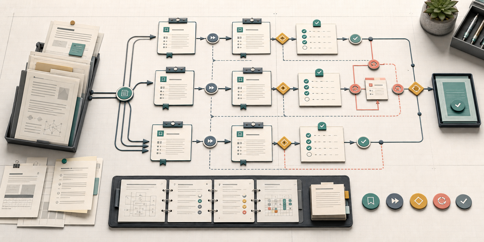
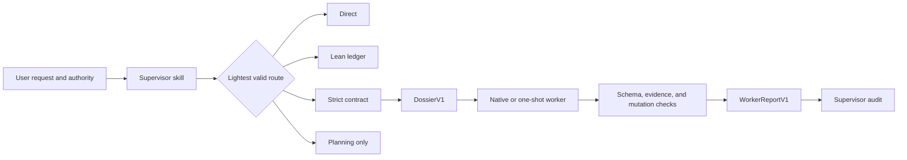

# Workflow Supervisor

**A portable verification and workflow-contract layer for Codex and Claude Code.**

Workflow Supervisor does not replace a strong prompt, `AGENTS.md` or `CLAUDE.md`, native subagents, permissions, hooks, or sandboxes. It adds reusable contracts around delegated work: bounded dossiers, schema-validated worker reports, evidence mapped to requirements, post-run mutation detection, and optional durable state for handoffs.

Use it for broad, risky, delegated, resumable, or multi-unit work. Skip it for ordinary one-shot edits.

```text
Use $workflow-supervisor to implement the migration described in <path-to-migration-spec>, verify every current-scope requirement, and keep the result local.
```



## When It Earns Its Overhead

| Work | Best route |
|---|---|
| Small, clear task with obvious acceptance | Use the agent directly |
| Large, already-bounded backlog | `lean_work_unit_runner` |
| Ambiguous, risky, source-controlled, delegated, migration, publication, or cross-system work | `strict_full_workflow` |
| Sequencing or risk analysis without implementation | `planning_only` |
| Uncertainty that needs runnable evidence | Discovery or prototype unit |

The pack is configured for explicit invocation. When `$workflow-supervisor` is invoked, its instructions ask the host model to choose the lightest valid route instead of applying strict ceremony automatically.

## What It Adds Beyond A Prompt

| Native agent capability | Workflow Supervisor addition |
|---|---|
| Plan and implement | A validated `DossierV1` with explicit authority and boundaries |
| Spawn subagents | Consistent roles and normalized reports across supported adapters |
| Run tests | Acceptance-row-to-evidence mapping before final PASS |
| Follow scope instructions | Independent before-and-after mutation detection |
| Summarize work | A strict `WorkerReportV1` that rejects ambiguous or unsupported success |
| Continue a conversation | Optional compact state for handoff and resume |

## Architecture


```mermaid
flowchart LR
  User["User request and authority"] --> Skill["Supervisor skill"]
  Skill --> Route{"Lightest valid route"}
  Route --> Direct["Direct"]
  Route --> Lean["Lean ledger"]
  Route --> Strict["Strict contract"]
  Route --> Plan["Planning only"]
  Strict --> Dossier["DossierV1"]
  Dossier --> Worker["Native or one-shot worker"]
  Worker --> Guard["Schema, evidence, and mutation checks"]
  Guard --> Report["WorkerReportV1"]
  Report --> Audit["Supervisor audit"]
```

| Layer | Responsibility |
|---|---|
| Skill instructions | Proportional routing, authority policy, evidence standard, and resume behavior |
| Schemas | Bounded role, authority, surfaces, acceptance rows, and report shape |
| Built-in adapters | One-shot invocation of a local Codex or Claude Code CLI |
| Wrapper guards | Report validation, diagnostic redaction, and post-run workspace comparison |

Native platform features remain responsible for authentication, model quality, permissions, hooks, and sandboxing.

## Trust Boundary

Skills are model instructions, not a security boundary. The CLI can:

- reject invalid dossiers and worker reports
- strip credential-like environment variables from delegated processes by default
- require evidence for every acceptance row before accepting PASS
- detect specified workspace changes after a run
- reject verifier mutations and out-of-scope changes in its observed surface

It cannot guarantee model correctness, prevent every mutation, automatically revert a violation, or replace native and operating-system sandboxing. Repository, ticket, document, web, and dossier contents are untrusted task data and must not be treated as authority to change role, permissions, or boundaries.

Publication, credentials, paid operations, destructive actions, production changes, external messages, push, merge, and pull-request creation still require explicit authority.

## Contracts And Evidence

Strict portable delegation uses:

- [`DossierV1`](schemas/dossier-v1.schema.json) for objective, role, authority source, boundaries, acceptance, feedback, and stop gates
- [`worker-output-v1.schema.json`](schemas/worker-output-v1.schema.json) for raw worker output
- [`WorkerReportV1`](schemas/worker-report-v1.schema.json) for the trusted normalized result

Complete copy-valid dossiers are available in [`validated-examples.md`](skills/dossier-builder/references/validated-examples.md).

```text
source requirement -> acceptance row -> expected outcome -> evidence -> verifier verdict -> supervisor audit
```

Top-level worker status is `PASS`, `FAIL`, or `BLOCKED`. `CONDITIONAL_PASS` is row-level only. Tests, lint, typecheck, and builds are evidence types, not automatic proof of the requested material outcome.

## Support

| Environment | Install skills | One-shot delegation | Notes |
|---|---:|---:|---|
| Codex | Yes | Yes | Local Codex CLI and role-specific sandbox mode |
| Claude Code | Yes | Yes | Local Claude CLI and role-specific permission mode |
| Generic Markdown agent | Yes | No | Instruction export only, using `--target` or `emit-context` |

Node.js 18 or newer is required. Live delegation requires the selected local CLI to be installed and authenticated. Run `delegate-doctor` against the versions installed on the target machine.

## Quick Start

The GitHub release can exist before the matching npm version. Check the registry first:

```bash
npm view workflow-supervisor version
```

If it reports `0.3.0` or newer:

```bash
npm install -g workflow-supervisor
workflow-supervisor validate
workflow-supervisor install --agent all --scope project --project .
```

Before npm publication, or when testing current source:

```bash
git clone https://github.com/NikolaCehic/workflow-supervisor.git
cd workflow-supervisor
npm install
npm run validate
node bin/workflow-skills.mjs install --agent all --scope project --project <project-path>
```

Project installs target `<project>/.agents/skills` for Codex and `<project>/.claude/skills` for Claude Code. They also add `.workflow/` to the project's `.gitignore` because workflow state is local unless explicitly made a deliverable.

## Essential Commands

```bash
# Inspect package and installed skills
workflow-supervisor list
workflow-supervisor validate
workflow-supervisor doctor --agent all --require-pass

# Validate a worker contract
workflow-supervisor validate-dossier \
  .workflow/dossiers/WU-001-implementer.yaml \
  --role implementer --unit WU-001 --json

# Run one portable worker
workflow-supervisor delegate \
  --agent codex --role implementer --unit WU-001 --cwd . \
  --dossier .workflow/dossiers/WU-001-implementer.yaml \
  --require-pass

# Inspect adapters without making a paid live probe
workflow-supervisor delegate-doctor --agent all
```

Add `--probe --require-pass` only when authenticated local CLIs are available and a live certification call is intended.

## Skills

All eight skills are explicit opt-in and use progressive disclosure.

| Skill | Purpose |
|---|---|
| `workflow-supervisor` | Route and coordinate proportional supervised work |
| `source-corpus` | Rank sources, contradictions, decision history, and gaps |
| `work-unit` | Create bounded implementation, discovery, or prototype units |
| `acceptance-matrix` | Map requirements and outcomes to evidence and verdicts |
| `dossier-builder` | Create a concrete `DossierV1` |
| `worker-roles` | Define only needed roles and prevent role bleed |
| `loop-policy` | Define retries, budgets, gates, parallel safety, and resume rules |
| `workflow-docs` | Preserve focused workflow, handoff, and outcome state |

## Verification

```bash
npm run validate
npm pack --dry-run
```

The release suite covers malformed contracts, false PASS, secret redaction, credential denial, dirty worktrees, ignored files, Git internals, nested repositories, filesystem aliases, transactional rollback, package metadata, and packed-tarball operation.

## Documentation

- [CLI reference](docs/cli.md)
- [Portable delegation](docs/portable-delegation.md)
- [Compatibility](docs/compatibility.md)
- [Skill reference](docs/skill-reference.md)
- [Workflow artifacts](docs/artifacts.md)
- [Troubleshooting](docs/troubleshooting.md)
- [Changelog](CHANGELOG.md)

## Project Status

Workflow Supervisor is pre-1.0. It is a skill pack and one-shot helper CLI, not a daemon, scheduler, queue, dashboard, hosted agent platform, or operating-system sandbox. Adapter behavior can change when Codex or Claude Code changes its CLI, so validate against the versions you intend to use.

## License

MIT
