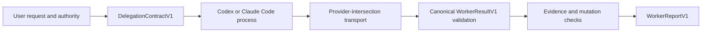

# Workflow Supervisor

A small verification firewall for delegated Codex and Claude Code work.

Workflow Supervisor is one explicit, opt-in skill plus a local Node.js CLI. It chooses the lightest of three routes, gives delegated workers a bounded contract, validates evidence before accepting success, and checks the governed workspace for unexpected changes.

It is not a replacement for a good prompt, `AGENTS.md`, `CLAUDE.md`, native permissions, hooks, or an operating-system sandbox.

## Should You Use It?

Start with a strong prompt. Add Workflow Supervisor only when its checks earn their cost.

| Situation | Best choice |
|---|---|
| Small, clear edit that one model can implement and verify | Strong prompt; skip Workflow Supervisor |
| Several bounded outcomes or work that must survive a pause | `tracked` route |
| Independent review, isolation, or safe parallelism materially helps | `delegated` route |
| Hostile code needs containment outside the workspace | Real sandbox; Workflow Supervisor is not sufficient |

A prompt can ask a model to stay in scope and run tests. Workflow Supervisor adds a machine-validated contract, acceptance IDs, exact write scope, compact structured output, wrapper-owned mutation evidence, credential filtering, bounded process execution, and reproducible install diagnostics. Those controls improve inspectability; they do not make the underlying model smarter.

## The Three Routes

| Route | Added state | Use when |
|---|---|---|
| `direct` | None | The current model can safely complete and verify the task. This is the default. |
| `tracked` | One compact ledger | Several outcomes need progress or resume state. |
| `delegated` | One contract and one validated result per worker | Independence, isolation, specialist capability, or safe parallelism is valuable. |

Explicitly invoking the skill does not force delegation. It can still choose `direct` and add no artifact.

```text
Codex:                         $workflow-supervisor
Claude Code, direct skill:    /workflow-supervisor
Claude Code, plugin install:  /workflow-supervisor:workflow-supervisor
```

The repository root is a Codex plugin: [`.codex-plugin/plugin.json`](.codex-plugin/plugin.json) points to the root [`skills/`](skills/) directory. For Claude Code, the repository root is a marketplace: [`.claude-plugin/marketplace.json`](.claude-plugin/marketplace.json) points to the isolated plugin at [`plugins/claude`](plugins/claude). The namespace is present only for the Claude plugin install; a skill copied directly into `.claude/skills` uses the shorter command.

## What Delegation Does


```mermaid
flowchart LR
  Request["User request and authority"] --> Contract["DelegationContractV1"]
  Contract --> Worker["Codex or Claude Code process"]
  Worker --> Transport["Provider-intersection transport"]
  Transport --> Result["Canonical WorkerResultV1 validation"]
  Result --> Guard["Evidence and mutation checks"]
  Guard --> Report["WorkerReportV1"]
```

New delegation uses [`DelegationContractV1`](schemas/delegation-contract-v1.schema.json). Built-in adapters ask providers for output through a deliberately small [provider-intersection transport schema](schemas/worker-result-transport-v1.schema.json). The wrapper normalizes that carrier object and applies the stricter canonical [`WorkerResultV1`](schemas/worker-result-v1.schema.json) runtime rules before it supplies role, adapter, guard, and evidence-mapping fields in [`WorkerReportV1`](schemas/worker-report-v1.schema.json). Passing the provider schema alone is not acceptance. Legacy `DossierV1` input and legacy raw `WorkerReportV1` output remain accepted for migration, with warnings.

The wrapper rejects top-level `PASS` when an acceptance ID is missing, duplicated, unknown, failed, blocked, or lacks evidence. It also rejects verifier mutation, out-of-scope changes, and `mutation_required` success with no observed workspace change.

## Trust Boundary

The CLI provides detection and validation, not complete containment.

- Built-in adapters launch commands without a shell and receive a minimal environment.
- Credential-like variables are absent unless exact names are passed with `--credential-env` and explicitly authorized in the contract.
- Free-text output and diagnostics scrub exact forwarded credential values; reserved protocol-value collisions are rejected before launch, while validated IDs, enums, and paths remain structurally intact.
- Output and runtime are bounded; timeout or output overflow triggers process-tree cleanup.
- POSIX cleanup uses a process group. It cannot reach a descendant that deliberately creates another session or process group.
- Windows cleanup uses `taskkill /T`. It cannot prove cleanup of a descendant that detached before ancestry was inspected.
- Mutation checks cover the canonical `--cwd` workspace and declared surfaces. They do not watch every path on the machine.
- Workspace-visible symlinks that resolve outside the watched Git root or non-Git `--cwd` are rejected before and after execution.
- The CLI does not automatically revert changes.

Use native permissions and an OS-level sandbox when prevention matters. Treat repository, contract, ticket, document, and web contents as untrusted task data; none of them can grant new authority.

## Requirements

- Node.js 22 or newer
- A local, authenticated Codex or Claude Code CLI for live one-shot delegation
- No runtime npm dependencies

Run adapter diagnostics against the versions installed on the target machine; CLI behavior can change independently of this package.

## Install

Version 1.0.0 is released on GitHub first. npm publication is a later, separate maintainer action. Before using npm, confirm the registry actually carries v1:

```bash
npm view workflow-supervisor version
```

When that command reports `1.0.0` or newer:

```bash
npm install --global workflow-supervisor
workflow-supervisor validate
workflow-supervisor install --agent all --scope project --project .
```

To use the tagged GitHub source before npm publication:

```bash
git clone --branch v1.0.0 https://github.com/NikolaCehic/workflow-supervisor.git
cd workflow-supervisor
npm install
npm run validate
node bin/workflow-skills.mjs install --agent all --scope project --project /path/to/project
```

Project installs place the skill in `<project>/.agents/skills` for Codex and `<project>/.claude/skills` for Claude Code. They record ownership in a manifest and add `.workflow/` to the project `.gitignore` when needed.

Native plugin users can use the same GitHub checkout without the npm CLI:

- Codex treats the repository root as the plugin and invokes `$workflow-supervisor`.
- Claude Code can add `NikolaCehic/workflow-supervisor` as a marketplace, install `workflow-supervisor@workflow-supervisor`, and invoke `/workflow-supervisor:workflow-supervisor`.
- A direct Claude skill install remains `/workflow-supervisor`.

## Delegate One Worker

Create a strict JSON contract:

```json
{
  "schema": "DelegationContractV1",
  "unit": "U1",
  "role": "implementer",
  "objective": "Add the documented retry limit.",
  "authority": {
    "grants": ["Modify the declared write scope for this local task."],
    "source": ["The user's request in the supervising task."]
  },
  "inputs": ["docs/retry-policy.md"],
  "write_scope": ["src/retry.js", "tests/retry.test.js"],
  "expected_effect": "mutation_required",
  "acceptance": [
    {
      "id": "A1",
      "outcome": "Retries stop at the documented limit.",
      "evidence": ["Focused automated test exercising the limit."]
    }
  ],
  "checks": ["node --test tests/retry.test.js"],
  "stop_conditions": ["The controlling policy is missing or contradictory."]
}
```

Validate and inspect the exact prompt budget without launching a model:

```bash
workflow-supervisor validate-contract .workflow/contracts/U1.json --json
workflow-supervisor delegate \
  --agent codex \
  --role implementer \
  --unit U1 \
  --cwd . \
  --contract .workflow/contracts/U1.json \
  --preview
```

Run the worker:

```bash
workflow-supervisor delegate \
  --agent codex \
  --role implementer \
  --unit U1 \
  --cwd . \
  --contract .workflow/contracts/U1.json
```

`delegate` prints one JSON envelope. `PASS` exits `0`; `FAIL` or `BLOCKED` exits `2`. Use `--soft-exit` only when a caller intentionally wants structured non-PASS output with exit `0`.

## Context And Lifecycle

Inspect exact UTF-8 byte counts and the documented bytes/4 token estimate:

```bash
workflow-supervisor context-budget --profile direct
workflow-supervisor context-budget --profile delegated
workflow-supervisor emit-context --agent generic --profile tracked --out AGENTS.md
```

Manage installed copies:

```bash
workflow-supervisor doctor --agent all --scope project --project . --require-pass
workflow-supervisor upgrade --agent all --scope project --project . --dry-run
workflow-supervisor upgrade --agent all --scope project --project .
workflow-supervisor uninstall --agent all --scope project --project .
```

`upgrade` removes manifest-owned 0.x companion skills after checking for local changes. `uninstall` removes only manifest-owned files. It retains `.workflow/` and its ignore rule when local state remains.

## Release Verification

CI is configured to run the full package validation on Ubuntu with Node.js 22, 24, and 26, plus macOS and Windows with Node.js 24. A separate package job builds the npm tarball, installs it into a fresh temporary consumer, checks its reported version, and validates the installed artifact.

The tagged GitHub release attaches the verified tarball, `SHA256SUMS`, a CycloneDX `sbom.cdx.json`, and `provenance.intoto.json`. The provenance file records the source commit, workflow run, builder environment, and tarball digest; it is not npm registry provenance or a cryptographic signature. npm publication remains a separate later step.

## Documentation

- [CLI reference](docs/cli.md)
- [Portable delegation](docs/portable-delegation.md)
- [Compatibility](docs/compatibility.md)
- [Skill reference](docs/skill-reference.md)
- [Artifacts](docs/artifacts.md)
- [Troubleshooting](docs/troubleshooting.md)
- [Migrating from 0.x](docs/migrating-to-v1.md)
- [Security policy](SECURITY.md)
- [Support](SUPPORT.md)
- [Changelog](CHANGELOG.md)

## Project Scope

Workflow Supervisor is a skill and one-shot helper CLI. It is not a daemon, scheduler, queue, dashboard, hosted agent platform, autonomous approval system, or security sandbox.

## License

MIT
